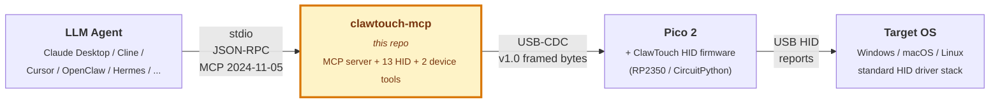

**English** | [简体中文](README.zh-CN.md)

# clawtouch-mcp

> **Give your AI agent real hands.**
> An MCP server that turns any MCP-compatible client — [Claude Desktop](https://claude.ai/download),
> [Cline](https://github.com/cline/cline), [Continue](https://github.com/continuedev/continue),
> [Cursor](https://www.cursor.com/), [OpenClaw](https://github.com/openclaw),
> [Hermes Agent](https://github.com/NousResearch/hermes-agent) and any other —
> into something that can move a real mouse and press real keys through a USB HID device.

[](https://pypi.org/project/clawtouch-mcp/)
[](https://pypi.org/project/clawtouch-mcp/)
[](LICENSE)
[](https://clawtouch.cn)

<p align="center">
  
</p>

---

## What is this?

A standalone Python process that speaks **Model Context Protocol** (MCP) over
stdio and exposes mouse / keyboard primitives — `hid.click`, `hid.type`,
`hid.scroll`, key combos, `hid.screenshot` — to whatever AI agent you already
use. Under the hood it talks over USB serial to a **ClawTouch HID device** (a
Raspberry Pi Pico 2 running the open [ClawTouch HID firmware](#hardware), or any
turnkey ClawTouch box) and translates each tool call into a real USB HID report.
The target OS sees a **genuine physical keyboard and mouse** — input arrives on
the same driver path as any plugged-in peripheral, not as a software-injected
synthetic event.

> 📦 MIT-licensed. No ClawTouch backend, no LLM, no agent loop on top —
> just the raw HID plumbing so other agent stacks can talk to real hardware.

> ⚠️ This gives an agent **real keyboard / mouse reach** over a machine —
> the same reach as a person at the keyboard. Read [Safety](#safety) first.

## Why hardware HID?

Software automation (PyAutoGUI, OS-level input APIs, multimodal click-the-screen
models) injects **synthetic** input events into a session — which requires an
agent process running on the target machine, in that user session, with focus.
A USB HID peripheral works the other way around: it emits **real** HID reports
that travel the standard OS HID driver stack, exactly like a plugged-in keyboard
or mouse. The OS recognizes the Pico natively as a standard USB HID class device
and needs **no mouse / keyboard driver and no HID agent process** on the input
side of the target. That difference is the whole point of this project — every
other section below just builds on it.

**Local mode is the common case** (agent + `clawtouch-mcp` + Pico + the screen
all on one PC; the `clawtouch-mcp` process lives there because it's the agent's
host, but the input side needs no driver). Cross-host control — agent on one
machine driving a target on another over USB HID — is an *additional* capability
the same hardware unlocks; see [Deployment modes](#deployment-modes).

**Good for:**

- **Kiosks / locked-down machines** — drive a machine you can't (or won't)
  install software on; nothing extra runs on the input side.
- **Accessibility** — let a user drive their own computer via an agent issuing
  HID commands, without fighting per-app synthetic-input compatibility.
- **Compatibility testing** — verify your software handles *external* HID input
  correctly, which can differ from injected synthetic events.
- **Cross-host RPA / test rigs** — an agent on your dev laptop drives an
  industrial PC, an offline test target, or a QA-lab phone, with no agent on
  the target (visual feedback needs a separate path — see Deployment modes).

**Not for:**

- **Mass account creation / multi-account operations** — a single-host tethered
  peripheral is structurally a poor fit; one device drives exactly one target,
  and to drive ten machines you buy ten devices.
- **Application-specific scripted shortcuts** (selectors, fixed-flow scripts for
  a particular site or app). Those belong in agent / RPA frameworks built on top
  of this primitive layer, not in this layer itself.

For standard desktop apps (browser, IDE, office suites) the software-only path
is already enough — the hardware is just an extra option there, not a
requirement. Its irreplaceable value is the cases above, where the target can't
host an agent, must show the OS a genuine physical HID device, or has to be
driven across machines. For the compliance boundary on the "not for" cases, see
[Acceptable use](#acceptable-use).

## Quickstart

> ⚠️ Before you start: read [Safety](#safety) — a connected agent can operate this machine like a person at the keyboard.

### Install

```bash
pip install clawtouch-mcp                 # minimal (serial only)
pip install 'clawtouch-mcp[screenshot]'   # + mss + Pillow for hid.screenshot tool
```

**Platform-specific setup guides** (recommended on first install):

* **Windows** — [`docs/windows-setup.md`](docs/windows-setup.md): dual
  COM port enumeration, VS Code Claude extension `.mcp.json` config,
  full window restart required, display-scaling notes.
* **macOS** — [`docs/macos-setup.md`](docs/macos-setup.md): Keyboard
  Setup Assistant dialog on first plug-in, dual USB-CDC ports, Screen
  Recording permission, Pinyin IME punctuation gotchas.

### Run

```bash
# 1. Auto-detect HID board AND auto-detect screen size (v0.2.3+)
clawtouch-mcp

# 2. Explicit port (Windows), screen still auto-detected
clawtouch-mcp --port COM7

# 3. Pin screen size manually (e.g. clamp to one monitor in a multi-monitor setup)
clawtouch-mcp --screen 1920x1080

# 4. No hardware — everything is logged, nothing moves (dev/CI mode)
clawtouch-mcp --mock --log-level INFO
```

> v0.2.3+ auto-detects the primary monitor's physical pixel size on
> startup so coordinates clamp to the actual screen rather than a
> hard-coded `1920x1080`. Use `device.info` from your MCP client to
> see what was detected (`screen.source` is `"detected"` /
> `"explicit"` / `"unset"`).

### Use with Claude Desktop

Add to `~/Library/Application Support/Claude/claude_desktop_config.json`
(macOS) or `%APPDATA%\Claude\claude_desktop_config.json` (Windows):

```json
{
  "mcpServers": {
    "clawtouch": {
      "command": "clawtouch-mcp",
      "args": ["--port", "COM7", "--screen", "1920x1080"]
    }
  }
}
```

Restart Claude Desktop. You should see `clawtouch` show up in the MCP server
list with 15 tools available (13 HID + 2 device; +1 if you pass
`--allow-screenshot`). Try:

> Take a screenshot of my screen, find the search box, click it, and type
> "hello world".

(Requires `--allow-screenshot` to enable the `hid.screenshot` tool — off by
default for privacy.)

### Other MCP clients

Copy-pasteable config for 7 verified clients (Claude Desktop / Code,
Cursor, OpenClaw, Hermes Agent, ChatGPT Desktop / Codex CLI,
Cherry Studio, Trae IDE) — see
[`examples/integrations/INTEGRATIONS.md`](examples/integrations/INTEGRATIONS.md).
PRs adding new clients welcome.

## Deployment modes

*Is the agent on the same machine as the screen?* `clawtouch-mcp` covers the **input side only** (agent tool call → HID report → real input). The **visual side** (agent reads the screen to decide what to do next) is **not in this repo** — how you wire the two sides together depends on where the agent runs.

**Local mode — the common case.** agent + `clawtouch-mcp` + Pico + the controlled screen all on **one PC**. `hid.screenshot` captures that same screen, so the visual feedback loop closes naturally; the Pico is a standard USB HID device needing no driver. Good for accessibility, single-machine RPA, compatibility testing, in-machine kiosk self-service.

**Cross-host mode — input supported, visual is your problem.** agent + `clawtouch-mcp` on machine **A**; the Pico and the controlled screen on machine **B**. This repo fully covers the input side (A → B over USB HID), **but `hid.screenshot` still captures A's screen, not B's** — HID carries input one-way only; reverse screen capture isn't in the spec. Pick a visual path: **HDMI capture card** (B stays truly software-free, needs capture hardware) · **VNC / RDP** (open, no vendor lock-in, but B is no longer software-free) · **API / log verification** (check progress at checkpoints, not real-time; fixed-flow RPA only) · **blind operation** (pre-baked command sequence, no feedback; fully deterministic macros only). Good for industrial PCs that can't run a modern OS, strictly isolated embedded test targets, QA-lab phone farms.

## Safety

> Read this before connecting an autonomous agent. The runtime limits
> above are flood / typo guards, **not** a security boundary against a
> misbehaving agent.

### Runtime safety limits

* Coordinates **clamped** to `--screen WxH` so an agent can't move the mouse
  to bogus pixel positions.
* Typed text **capped at 4096 chars** per call.
* `hid.type` is for **ASCII / US-keyboard-layout text**. Control
  characters (newline / tab / etc.) are **stripped** by default so an
  agent's multi-line draft isn't accidentally submitted — send Enter with
  `hid.key("enter")` and Tab with `hid.key("tab")`. Non-ASCII text (CJK,
  emoji) is typed through the US layout and generally will **not** work;
  drive the host IME or a clipboard path from your agent for those.
* All operations **rate-limited** to `--ops-per-sec` (default 20). This
  counts *tool calls*, not individual HID reports — one call such as
  `hid.drag` or a long `hid.type` emits many reports, so the effective
  HID-report rate is higher. It is a flood / typo guard, not a security
  throttle.
* `hid.screenshot` is **disabled unless** you pass `--allow-screenshot`.
* `hid.release_all` exposed for use as a panic-stop tool from the agent.

### What an agent connected to this can do

`clawtouch-mcp` turns your agent's tool calls into **real USB HID input** — the
same property that makes the legitimate use cases work (kiosks, accessibility,
compatibility testing, cross-host RPA) carries a symmetric risk:

**An autonomous agent connected here has, in practice, the same reach over the
host as a person sitting at the keyboard.** It can open any application, run
commands in a terminal, install or remove software, and read, move, or delete
files. Because the input arrives as ordinary HID, a confirmation prompt is not
by itself a reliable barrier — treat any consent dialog as something the agent
may act on. `clawtouch-mcp` does **not** inspect intent or content; it
faithfully forwards each call to the hardware.

This can happen **without you intending it**, because the *agent* decides what
to do. The usual triggers:

- **Prompt injection.** Untrusted text the agent reads off the screen, a web
  page, or an image can carry instructions that override yours.
- **Model error.** The model misunderstands the task and acts on the wrong
  window, file, or button.
- **Over-broad autonomy.** The more open-ended the task and the fewer the
  checkpoints, the larger the blast radius.

This is an **unintended failure mode**, not a supported use — deliberately
using HID input to defeat a system's security controls is out of scope under
**Acceptable use** below. It is also distinct from software bugs in
[`SECURITY.md`](SECURITY.md): none of those cover an agent acting against your
own intent. The MIT "AS IS / no warranty" clause is a liability disclaimer, not
an informed-risk notice; responsibility for running an autonomous agent safely
sits with you as the deployer. This notice is provided for information only —
it does not modify, narrow, or expand the MIT License, create any warranty or
duty of care, or shift liability to Tinqiao; the MIT no-warranty / no-liability
terms continue to govern in full.

### Operator mitigations

Treat an agent driving HID input like giving a capable but not-fully-trusted
operator real hands on the machine. Recommended:

- **Use a dedicated, wipeable machine (or a VM / container)** — not your primary
  computer. Local mode puts agent and target on one PC: convenient, but the
  largest blast radius; prefer a separate machine where you can.
- **Run under a least-privilege OS account**, never as administrator / root —
  the agent inherits whatever that account can do.
- **Keep secrets and logged-in accounts off the target** — no saved passwords,
  no authenticated sessions, no credentials in the prompt.
- **Keep a human in the loop** for consequential or irreversible actions
  (installing/deleting software, sending messages, financial transactions,
  agreeing to terms); don't leave the agent unattended on open-ended tasks.
- **Isolate the network** (e.g. a domain allowlist) to limit exposure to
  malicious or injection-bearing content.
- **Treat everything read from screen or web as untrusted input** and keep it
  away from sensitive data and actions.
- **Keep a panic stop reachable.** `hid.release_all` releases every held key and
  button from the agent side; physically unplugging the HID device's USB cable
  is the most reliable stop and removes the agent's input path entirely.

If you deploy this on behalf of others (accessibility, managed RPA), inform
those end users of these risks and obtain their consent.

## Tools

Sixteen tools register: **thirteen always-on `hid.*` input tools**, plus
**`hid.screenshot`** (opt-in — off unless you pass `--allow-screenshot`), plus
**two read-only `device.*` diagnostics**. That matches the startup log line
`13 HID tools + 2 device tools registered` (the `--allow-screenshot` flag adds
`hid.screenshot` on top, for 16).

| Tool | Since | Purpose |
|------|-------|---------|
| `hid.click` | v1.0 | Click at (x, y) |
| `hid.move` | v1.0 | Move the mouse to (x, y) |
| `hid.hover` | v1.0 | Move to (x, y), then idle |
| `hid.type` | v1.0 | Type a UTF-8 string |
| `hid.scroll` | v1.0 | Wheel scroll up / down |
| `hid.key` | v1.0 | Press a named key or shortcut (`enter`, `ctrl+c`, …) |
| `hid.release_all` | v1.0 | Panic stop — release every held button and key |
| `hid.mouse_button_down` | v1.1 | Press a mouse button without releasing (drag start) |
| `hid.mouse_button_up` | v1.1 | Release a held mouse button (drag end) |
| `hid.drag` | v1.1 | Drag from one point to another while holding a button |
| `hid.key_press` | v1.1 | Press a key/shortcut without releasing |
| `hid.key_release` | v1.1 | Release a held key (no args = release everything) |
| `hid.hold_key` | v1.1 | Press, wait, then release |
| `hid.screenshot` | v1.0 | Screenshot the primary monitor — JPEG q80 default, `format='png'` for lossless (opt-in, requires `--allow-screenshot`) |
| `device.list` | v1.0 | List candidate HID board ports |
| `device.info` | v1.0 | Active connection info |

**Coordinates & behavior.** Click / move / hover are **absolute by default**:
the server queries the OS cursor position (Win32 / CoreGraphics / X11), computes
the offset to your target, and sends a **relative delta** to the firmware — so
`{"x": 640, "y": 360}` lands at that screen pixel. Pass `relative=true` to skip
the OS query and send a raw pixel delta instead. Where the OS cursor can't be
read (Wayland, or any OS-query failure) the call returns an **explicit error** —
it never silently guesses and clicks the wrong place. `hid.drag` composes
`mouse_button_down` → glided `move` → `mouse_button_up`; the `v1.1` button/key
hold pair (`mouse_button_*`, `key_press` / `key_release`, `hold_key`) maps onto
the Computer-Use Anthropic (CUA) action set.

**Tool selection.** The server ships built-in selection guidance so an agent
reaches for physical HID only when it's the right answer: an MCP `instructions`
field in the `initialize` response, plus a per-tool `HID_PREFIX` prepended to
every `hid.*` description (so the cue survives even if a client ignores the
server-level field). Both say the same thing — prefer `hid.*` only as a
**fallback**, when no file / browser / OS API can do the job, or when the user
explicitly asks for physical keyboard / mouse input. The read-only `device.*`
tools carry no prefix.

## Examples

Most agents reach `clawtouch-mcp` through an MCP client (Claude Desktop / Code, Cursor, and others) — copy-pasteable configs for the verified clients are in [`examples/integrations/INTEGRATIONS.md`](examples/integrations/INTEGRATIONS.md).

If you're building your own Computer Use loop instead, [`examples/computer_use/`](examples/computer_use/) has two reference implementations that route agent actions through ClawTouch HID:

- [Claude Computer Use → HID](examples/computer_use/claude_demo.py) — `client.beta.messages.stream` with the `computer_20251124` tool
- [OpenAI CUA → HID](examples/computer_use/openai_cua_demo.py) — Responses API with `computer-use-preview`

For per-application LLM guidance, [`clawtouch-skills`](https://github.com/tinqiao-oss/clawtouch-skills) is a companion repo of markdown operator manuals an LLM can load before driving a specific app. Skills are soft guidance — the LLM still decides what to do.

### See it in action

Start the server against your bridge, then any MCP client (Claude
Desktop, Cline, or your own loop) speaks plain MCP `tools/call` over
stdio. Each call becomes a real USB-CDC frame to real hardware —
nothing synthetic.

```text
$ clawtouch-mcp --port COM7
[INFO] connected to Pico 2 on COM7 (serial: E660ABCD12345678)
[INFO] screen auto-detected: 2560x1440 (Windows SM_CXSCREEN/SM_CYSCREEN)
[INFO] 13 HID tools + 2 device tools registered; listening on stdio

# client → server : one click, then one typed string
#                   (the cursor and keys actually move)
→ tools/call  hid.click  {"x": 640, "y": 360}
← result       "clicked at (640, 360)"

→ tools/call  hid.type   {"text": "Hello from MCP"}
← result       "typed 14 chars in 0.42s"
```

## Acceptable use

This server is built for legitimate uses — accessibility, RPA, test
automation, cross-machine workflows where the target machine must
stay clean. This project does **not** support, document, or assist
with use cases that:

- Bypass, evade, or interfere with any target platform's anti-fraud,
  anti-abuse, rate-limiting, or risk-control measures.
- Operate accounts the user does not lawfully own or have explicit
  authorization to operate.
- Are prohibited by the target application's Terms of Service in
  the user's jurisdiction.
- Violate applicable law — including, but not limited to, PRC
  *Anti-Unfair Competition Law* Art. 13 (the Internet sector
  specific provision; promulgated 2025-06-27, effective
  2025-10-15) covering improper means — including circumventing
  technical management measures — to acquire or use another
  operator's data; *Personal Information Protection Law*;
  *Cybersecurity Law*; and equivalent laws in other jurisdictions.

These statements describe the scope of our maintainer support and
documentation — they are **not** additional restrictions on the
MIT License, which continues to govern all use, modification, and
redistribution of the source code. Users are independently
responsible for evaluating their specific use case against
applicable laws and the target platform's ToS.

## Content generation — out of scope

`clawtouch-mcp` exposes hardware HID actions (mouse / keyboard / scroll
/ key combos / screenshot) as MCP tools. It does **not** generate,
synthesize, recommend, or otherwise produce text, image, audio, or
video content. The calling LLM agent is the content-generating party
and is solely responsible for any generated content and for
compliance with any content-labeling or content-moderation
obligations applicable in its jurisdiction (e.g. PRC *AI Generated
Content Labeling Measure* effective 2025-09-01).

## Hardware

This server can talk to:

1. **ClawTouch HID device** — turnkey hardware, drop-shipped, plug-and-play.
   Order or get a sample at [clawtouch.cn](https://clawtouch.cn).
2. **Any RP2350 board running [clawtouch-hid](https://github.com/tinqiao-oss/clawtouch-hid)** —
   the OSS firmware + protocol module (wire epoch 1, frozen envelope) live in their own public repo.
   Buy a Pico 2 (~$8), flash the firmware, you're done.

The wire protocol is the same for both — the server doesn't care which one it
talks to.

## FAQ

**Does this need a ClawTouch account / API key / cloud service?**
No. This server only speaks USB serial to the HID board. There's no network
call. No data leaves your machine.

**Can I use this without buying ClawTouch hardware?**
Yes — buy an $8 Raspberry Pi Pico 2, flash the open-source
[clawtouch-hid](https://github.com/tinqiao-oss/clawtouch-hid) firmware,
and the server will talk to it the same way as the turnkey device.

**How is this different from the closed-source ClawTouch desktop app?**
This MCP server is the bottom HID primitive layer. The desktop product
is a separate closed-source agent on top of the same hardware; contact
`support@tinqiao.com` for details.

**Is there a JavaScript / TypeScript version?**
Not yet. `clawtouch-bridge-sdk` (Python + Node) is planned — see the
[Open source roadmap](#open-source-roadmap-contributing--license).

## Related work

The MCP / Computer-Use ecosystem already has projects that hand an LLM agent control of a desktop, in two camps. **Software-only MCP servers on the target PC** — [`domdomegg/computer-use-mcp`](https://github.com/domdomegg/computer-use-mcp), [`AB498/computer-control-mcp`](https://github.com/AB498/computer-control-mcp), the various [`mcp-pyautogui`](https://github.com/hathibelagal-dev/mcp-pyautogui) implementations, and ByteDance's [UI-TARS](https://github.com/bytedance/UI-TARS-desktop) — call PyAutoGUI / OS input APIs in-process: lowest friction, but the agent shares the target's OS / session / focus, and a crash disrupts the user's actual desktop. **Hardware-bridge servers** decouple the two: [`sunasaji/mcp-serial-hid-kvm`](https://github.com/sunasaji/mcp-serial-hid-kvm) (a CH9329 / CH9350L USB-HID ASIC plus capture card) is the closest direct peer in architecture, and CMU's [**HIDAgent**](https://arxiv.org/abs/2602.00492) (Bigham et al., 2026-01; < $30 RP2040 + HDMI-to-USB + CH340 serial bridge, shipped as a Python library) the closest academic peer. `clawtouch-mcp` follows the same decoupling but pairs with the open-firmware [`clawtouch-hid`](https://github.com/tinqiao-oss/clawtouch-hid) stack, so the wire protocol is user-extensible and the firmware is auditable — not a fixed-function ASIC.

ClawTouch's irreplaceable edge is the **genuine hardware HID path**: the OS sees a real physical keyboard / mouse. In local mode — the common case — that real HID plus zero driver on the input side is exactly what makes it work for accessibility, compatibility testing, and apps that reject synthetic input; if you only need synthetic input on one machine and the app doesn't care where input comes from, the software-only servers above are simpler. Cross-host mode is an *additional* capability on top: it can drive a target that can't host an agent or must stay physically isolated — something a software-only server can't do at all.

## Open source roadmap, contributing & license

**Open-core model.** Hardware and protocol primitives are open; the integrated commercial product stays closed.

| Component | Status |
|---|---|
| **clawtouch-mcp** (this repo) | ✅ Released |
| **[clawtouch-hid](https://github.com/tinqiao-oss/clawtouch-hid)** — firmware + protocol module, wire epoch 1 | ✅ Released |
| **[clawtouch-skills](https://github.com/tinqiao-oss/clawtouch-skills)** — markdown skill files for LLM agents | ✅ Released |
| **clawtouch-bridge-sdk** — Python + Node HID SDK | 🔵 Future |
| Backend / desktop app / adapters / vision models | 🔒 Closed — `support@tinqiao.com` |

### Contributing

PRs welcome for: new MCP tools mapping to existing HID primitives, bug fixes, client-integration examples, doc improvements, non-English README translations.

Not taking PRs for: agent-loop logic or application-level features (intentionally out of scope — see [Acceptable use](#acceptable-use)) or adapters for specific applications (those live in the closed-source desktop app).

`clawtouch-mcp` is maintained by **Tinqiao Technology** — the team behind **ClawTouch** ([clawtouch.cn](https://clawtouch.cn)).

### License

MIT © Tinqiao Technology (Beijing) Co., Ltd. — see [LICENSE](LICENSE)
(English, authoritative) and [LICENSE.zh-CN.md](LICENSE.zh-CN.md)
(non-official Chinese translation, for reference).

Third-party dependencies and their licenses are listed in
[NOTICE](NOTICE). Trademarks (ClawTouch, Tinqiao, and third-party
marks referenced in this repository) are covered separately in
[TRADEMARKS.md](TRADEMARKS.md) — the MIT License does **not** grant
any trademark rights.

For commercial deployments at scale, enterprise support, or OEM hardware
discussion: `support@tinqiao.com`.

## Architecture overview



This repo is the MCP-server hop: it translates MCP tool calls into framed bytes over USB-CDC; the firmware turns them into standard USB HID reports. For how it fits the larger Perception → Decision → Action loop and how the closed-source desktop app layers on these open HID primitives, see the official technical documentation: [system architecture &amp; data flow](https://clawtouch.cn/en/docs/architecture.html) and [data security &amp; compliance](https://clawtouch.cn/en/docs/security.html).