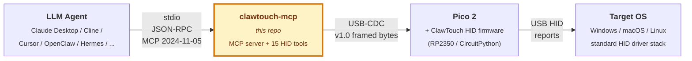

**English** | [简体中文](README.zh-CN.md)

# clawtouch-mcp

> **Give your AI agent real hands.**
> An MCP server that turns any MCP-compatible client — [Claude Desktop](https://claude.ai/download),
> [Cline](https://github.com/cline/cline), [Continue](https://github.com/continuedev/continue),
> [Cursor](https://www.cursor.com/), [OpenClaw](https://github.com/openclaw),
> [Hermes Agent](https://github.com/NousResearch/hermes-agent) and any other —
> into something that can move a real mouse and press real keys through a USB HID device.

[](https://pypi.org/project/clawtouch-mcp/)
[](https://pypi.org/project/clawtouch-mcp/)
[](LICENSE)
[](https://clawtouch.cn)

<p align="center">
  
</p>

---

## What is this?

A standalone Python process that speaks **Model Context Protocol** (MCP) over
stdio and exposes mouse / keyboard primitives to whatever AI agent you have.
Under the hood it talks to a **ClawTouch HID device** — a Raspberry Pi Pico 2
running the open [ClawTouch HID firmware](#hardware) over USB serial — and
translates `hid.click` / `hid.type` / `hid.scroll` tool calls into real HID
reports that travel through the OS HID driver stack on **the same input path
as any plugged-in external keyboard or mouse**.

**Why care?** A physical USB HID peripheral routes input through the
standard OS HID driver stack — the same path as any plug-in keyboard
or mouse — and needs no mouse/keyboard driver or HID agent process
installed on the target. The Pico is a standard USB HID class device,
recognized natively by every OS. That fits locked-down kiosks,
embedded test harnesses, cross-machine RPA, and any scenario where
the target machine must stay clean on the HID-input side.

> 📦 MIT-licensed. No ClawTouch backend, no LLM, no agent loop on top —
> just the raw HID plumbing so other agent stacks can talk to real hardware.

## Deployment modes — is the agent on the same machine as the screen?

`clawtouch-mcp` covers the **input side only** (agent tool call → HID
report → real input). The **visual side** (agent reads the screen to
decide what to do next) is **not in this repo** — how you wire the two
sides together depends on where the agent runs.

### Local mode — the common case

agent + `clawtouch-mcp` + Pico + the controlled screen all on **one
PC**. `hid.screenshot` captures the screen of the machine the agent
runs on, so the visual feedback loop closes naturally. The Pico is a
standard USB HID device — this PC needs no driver and no HID agent on
the input side (the `clawtouch-mcp` process itself does live here,
because that's the agent's host).

Good for: accessibility, single-machine RPA, compatibility testing,
in-machine kiosk self-service.

### Cross-host mode — input supported, visual is your problem

agent + `clawtouch-mcp` on machine **A**; the Pico and the controlled
screen are on machine **B**. This repo fully covers the input side
(A → B over USB HID), **but `hid.screenshot` still captures A's
screen, not B's** — the HID protocol carries input one-way only, and
reverse screen capture isn't in the HID spec. You have to pick one
of these for the visual path:

- **HDMI capture card** — B's HDMI output feeds A's capture card, the
  agent on A reads frames from there. B stays truly software-free at
  the cost of extra capture hardware.
- **VNC / RDP / screen sharing** — install a VNC server on B. Open
  protocols with no vendor lock-in, but B is no longer software-free.
- **API / log verification** — the agent doesn't watch B's screen in
  real time; it verifies progress at checkpoints via an API, log file,
  or database on B. Fits fixed-flow RPA, not open-ended tasks.
- **Blind operation** — the agent issues a full pre-baked command
  sequence without reading any feedback. Only works for fully
  deterministic scenarios (e.g. a hand-tuned macro).

Good for: industrial PCs that can't run a modern OS / strictly
isolated embedded test targets / QA-lab phone farms.

## Scope — what this is and isn't

**One device, one target.** The hardware is a USB peripheral with a
single host connection. Whatever you plug it into is the one machine
it can drive. That's by design — this is a tethered control device,
not a fleet automation tool. If you want to drive ten machines you buy
ten devices.

We support these scenarios:

- **RPA / test automation** — bridge an AI agent to an old machine you
  can't install software on, a kiosk shell, an industrial PC running
  an unsupported OS, or a phone in your QA lab.
- **Accessibility** — let a disabled user drive their own computer via
  a screen reader plus an AI agent issuing HID commands, instead of
  fighting with synthetic-input compatibility on each app.
- **Compatibility testing** — verify your software treats external HID
  input correctly, which can differ from injected synthetic input.
- **Cross-machine workflows** — an agent on your dev laptop driving
  the test machine in the rack, with no HID driver / HID agent on the
  target (visual feedback needs a separate path — HDMI capture / VNC /
  API checkpoints / blind operation; see "Deployment modes" above).

We do **not** support, document, or assist with:

- **Mass account creation / multi-account operations** on consumer
  platforms — a single-host tethered peripheral is structurally a
  poor fit. Users are responsible for checking applicable laws and
  platform policies in their own jurisdiction before any such use.
- **Application-specific scripted shortcuts** (selectors, fixed-flow
  scripts for a particular site or app). Those belong in agent / RPA
  frameworks built on top of this primitive layer.

If you're looking for either of the above, this isn't the right tool.

## Content generation — out of scope

`clawtouch-mcp` exposes hardware HID actions (mouse / keyboard / scroll
/ key combos / screenshot) as MCP tools. It does **not** generate,
synthesize, recommend, or otherwise produce text, image, audio, or
video content. The calling LLM agent is the content-generating party
and is solely responsible for any generated content and for
compliance with any content-labeling or content-moderation
obligations applicable in its jurisdiction (e.g. PRC *AI Generated
Content Labeling Measure* effective 2025-09-01).

## Acceptable use

This server is built for legitimate uses — accessibility, RPA, test
automation, cross-machine workflows where the target machine must
stay clean. This project does **not** support, document, or assist
with use cases that:

- Bypass, evade, or interfere with any target platform's anti-fraud,
  anti-abuse, rate-limiting, or risk-control measures.
- Operate accounts the user does not lawfully own or have explicit
  authorization to operate.
- Are prohibited by the target application's Terms of Service in
  the user's jurisdiction.
- Violate applicable law — including, but not limited to, PRC
  *Anti-Unfair Competition Law* Art. 13 (the Internet sector
  specific provision; promulgated 2025-06-27, effective
  2025-10-15) covering improper means — including circumventing
  technical management measures — to acquire or use another
  operator's data; *Personal Information Protection Law*;
  *Cybersecurity Law*; and equivalent laws in other jurisdictions.

These statements describe the scope of our maintainer support and
documentation — they are **not** additional restrictions on the
MIT License, which continues to govern all use, modification, and
redistribution of the source code. Users are independently
responsible for evaluating their specific use case against
applicable laws and the target platform's ToS.

## Install

```bash
pip install clawtouch-mcp                 # minimal (serial only)
pip install 'clawtouch-mcp[screenshot]'   # + mss for hid.screenshot tool
```

**Platform-specific setup guides** (recommended on first install):

* **Windows** — [`docs/windows-setup.md`](docs/windows-setup.md): dual
  COM port enumeration, VS Code Claude extension `.mcp.json` config,
  full window restart required, display-scaling notes.
* **macOS** — [`docs/macos-setup.md`](docs/macos-setup.md): Keyboard
  Setup Assistant dialog on first plug-in, dual USB-CDC ports, Screen
  Recording permission, Pinyin IME punctuation gotchas.

## Run

```bash
# 1. Auto-detect HID board AND auto-detect screen size (v0.2.3+)
clawtouch-mcp

# 2. Explicit port (Windows), screen still auto-detected
clawtouch-mcp --port COM7

# 3. Pin screen size manually (e.g. clamp to one monitor in a multi-monitor setup)
clawtouch-mcp --screen 1920x1080

# 4. No hardware — everything is logged, nothing moves (dev/CI mode)
clawtouch-mcp --mock --log-level INFO
```

> v0.2.3+ auto-detects the primary monitor's physical pixel size on
> startup so coordinates clamp to the actual screen rather than a
> hard-coded `1920x1080`. Use `device.info` from your MCP client to
> see what was detected (`screen.source` is `"detected"` /
> `"explicit"` / `"unset"`).

## See it in action

A complete session: the server starts, an MCP client (could be Claude
Desktop, Cline, your own loop, anything) sends the standard MCP
`initialize` handshake, lists the tools, and fires a click and a
type-string. Stdout below is line-delimited JSON-RPC; everything goes
through real USB-CDC frames to real Pico 2 hardware.

```text
$ clawtouch-mcp --port COM7
[INFO] clawtouch-mcp 0.2.3 starting (mock=False)
[INFO] connected to Pico 2 on COM7 (serial: E660ABCD12345678)
[INFO] screen auto-detected: 2560x1440 (Windows SM_CXSCREEN/SM_CYSCREEN)
[INFO] 15 HID tools + 2 device tools registered; listening on stdio

# ── MCP client → server ─────────────────────────────────────────────
< {"jsonrpc":"2.0","id":1,"method":"initialize",
   "params":{"protocolVersion":"2024-11-05","capabilities":{},
             "clientInfo":{"name":"any-mcp-client","version":"1.0"}}}
> {"jsonrpc":"2.0","id":1,"result":{"protocolVersion":"2024-11-05",
   "capabilities":{"tools":{"listChanged":false}},
   "serverInfo":{"name":"clawtouch-mcp","version":"0.2.3"}}}

< {"jsonrpc":"2.0","method":"notifications/initialized"}

< {"jsonrpc":"2.0","id":2,"method":"tools/list"}
> {"jsonrpc":"2.0","id":2,"result":{"tools":[
   {"name":"hid.click",...}, {"name":"hid.move",...},
   {"name":"hid.type",...},  {"name":"hid.scroll",...},
   {"name":"hid.key",...},   {"name":"hid.release_all",...},
   {"name":"hid.screenshot",...}, {"name":"device.list",...},
   {"name":"device.info",...} ]}}

# ── one click + one typed string (real hardware moves) ──────────────
< {"jsonrpc":"2.0","id":3,"method":"tools/call",
   "params":{"name":"hid.click","arguments":{"x":640,"y":360}}}
> {"jsonrpc":"2.0","id":3,"result":{"content":[
   {"type":"text","text":"clicked at (640, 360)"}],"isError":false}}

< {"jsonrpc":"2.0","id":4,"method":"tools/call",
   "params":{"name":"hid.type","arguments":{"text":"Hello from MCP"}}}
> {"jsonrpc":"2.0","id":4,"result":{"content":[
   {"type":"text","text":"typed 14 chars in 0.42s"}],"isError":false}}
```

## Use with Claude Desktop

Add to `~/Library/Application Support/Claude/claude_desktop_config.json`
(macOS) or `%APPDATA%\Claude\claude_desktop_config.json` (Windows):

```json
{
  "mcpServers": {
    "clawtouch": {
      "command": "clawtouch-mcp",
      "args": ["--port", "COM7", "--screen", "1920x1080"]
    }
  }
}
```

Restart Claude Desktop. You should see `clawtouch` show up in the MCP server
list with 15 tools available. Try:

> Take a screenshot of my screen, find the search box, click it, and type
> "hello world".

(Requires `--allow-screenshot` to enable the `hid.screenshot` tool — off by
default for privacy.)

## Use with other MCP clients

Copy-pasteable config for 7 verified clients (Claude Desktop / Code,
Cursor, OpenClaw, Hermes Agent, ChatGPT Desktop / Codex CLI,
Cherry Studio, Trae IDE) — see
[`examples/integrations/INTEGRATIONS.md`](examples/integrations/INTEGRATIONS.md).
PRs adding new clients welcome.

## Use with Computer Use loops

If you're building your own Computer Use loop (instead of plugging
into an MCP client), see [`examples/computer_use/`](examples/computer_use/)
for two reference implementations that route Anthropic / OpenAI agent
actions through ClawTouch HID:

- [Claude Computer Use → HID](examples/computer_use/claude_demo.py) —
  `client.beta.messages.create` with the `computer_20250124` tool
- [OpenAI CUA → HID](examples/computer_use/openai_cua_demo.py) —
  Responses API with `computer-use-preview`

Both demos import `clawtouch_mcp.bridge.SerialHidBridge` directly (no
MCP subprocess) and run on a single machine.

## Application skills (LLM guidance)

[`clawtouch-skills`](https://github.com/tinqiao-oss/clawtouch-skills)
is a companion repository of **markdown skill files** — operator
manuals for specific applications that an LLM can load before driving
that app through `clawtouch-mcp`. The first batch covers Chinese-
market apps where LLM training data is thin and the delta between
"LLM guesses" and "actual UI" is widest:

- WPS Office, Feishu / Lark, DingTalk —
  see [`tinqiao-oss/clawtouch-skills`](https://github.com/tinqiao-oss/clawtouch-skills)

Skills are soft guidance — the LLM still decides what to do.

## Tools exposed

| Tool                     | Since | Purpose                                       |
|--------------------------|-------|-----------------------------------------------|
| `hid.click`              | v1.0  | Click at (x, y). Absolute by default (server queries the OS cursor via Win32 / CoreGraphics / X11, computes a delta, sends a relative move to the firmware); pass `relative=true` to skip the OS query and send a raw pixel delta. Wayland / OS-query failures → explicit error |
| `hid.move`               | v1.0  | Move mouse to (x, y). Same absolute-by-default semantics as `hid.click`; `relative=true` sends a raw pixel delta |
| `hid.hover`              | v1.0  | Move (absolute), then idle                    |
| `hid.type`               | v1.0  | Type a UTF-8 string                           |
| `hid.scroll`             | v1.0  | Wheel scroll (positive = up, negative = down) |
| `hid.key`                | v1.0  | Named key / shortcut (`enter`, `ctrl+c`, …)   |
| `hid.release_all`        | v1.0  | Panic stop — release every held button / key  |
| `hid.mouse_button_down`  | **v1.1**  | Press a mouse button without releasing (drag start; matches CUA `left_mouse_down`) |
| `hid.mouse_button_up`    | **v1.1**  | Release a previously-pressed mouse button (drag end; matches CUA `left_mouse_up`) |
| `hid.drag`               | **v1.1**  | Drag from (`from_x`, `from_y`) to (`to_x`, `to_y`) while holding a button — composes `mouse_button_down` → glided `move` → `mouse_button_up`; matches CUA `left_click_drag` |
| `hid.key_press`          | **v1.1**  | Press a key (or shortcut) without releasing — useful for `hold shift while clicking N times` multi-select |
| `hid.key_release`        | **v1.1**  | Release a previously-pressed key; no args = release all keys + mouse buttons |
| `hid.hold_key`           | **v1.1**  | Press → wait `duration_ms` → release (matches CUA `hold_key`) |
| `hid.screenshot`         | v1.0  | PNG screenshot of primary monitor (opt-in)    |
| `device.list`            | v1.0  | List candidate HID board ports                |
| `device.info`            | v1.0  | Active connection info                        |

## Safety

* Coordinates **clamped** to `--screen WxH` so an agent can't move the mouse
  to bogus pixel positions.
* Typed text **capped at 4096 chars** per call.
* All operations **rate-limited** to `--ops-per-sec` (default 20).
* `hid.screenshot` is **disabled unless** you pass `--allow-screenshot`.
* `hid.release_all` exposed for use as a panic-stop tool from the agent.

## Hardware

This server can talk to:

1. **ClawTouch HID device** — turnkey hardware, drop-shipped, plug-and-play.
   Order or get a sample at [clawtouch.cn](https://clawtouch.cn).
2. **Any RP2350 board running [clawtouch-hid](https://github.com/tinqiao-oss/clawtouch-hid)** —
   the OSS firmware + frozen v1.0 protocol live in their own public repo.
   Buy a Pico 2 (~$8), flash the firmware, you're done.

The wire protocol is the same for both — the server doesn't care which one it
talks to.

## FAQ

**Does this need a ClawTouch account / API key / cloud service?**
No. This server only speaks USB serial to the HID board. There's no network
call. No data leaves your machine.

**Can I use this without buying ClawTouch hardware?**
Yes — buy an $8 Raspberry Pi Pico 2, flash the open-source
[clawtouch-hid](https://github.com/tinqiao-oss/clawtouch-hid) firmware,
and the server will talk to it the same way as the turnkey device.

**Why HID instead of OS-level mouse/keyboard APIs?**
OS-level input APIs require an agent process to be running on the
target machine and only work where such an agent can be installed. A
USB HID peripheral routes through the standard OS HID driver stack
and needs no mouse/keyboard driver or HID agent on the target —
fitting kiosk automation, offline test rigs, accessibility tooling,
and cross-machine RPA. (In local mode the agent process still lives
on the same PC — just on the input side that PC needs no extra
driver. In cross-host mode you'll need to wire up the visual feedback
side separately; see "Deployment modes" above.)

**Is there a JavaScript / TypeScript version?**
Not yet. `clawtouch-bridge-sdk` (Python + Node) is planned — see roadmap.

**How is this different from the closed-source ClawTouch desktop app?**
This MCP server is the bottom HID primitive layer. The desktop product
is a separate closed-source agent on top of the same hardware; contact
`support@tinqiao.com` for details.

## Related work

The MCP / Computer-Use ecosystem already has several projects that hand
an LLM agent control of a desktop. They split into two camps:

* **Software-only MCP servers on the target PC** —
  [`domdomegg/computer-use-mcp`](https://github.com/domdomegg/computer-use-mcp),
  [`AB498/computer-control-mcp`](https://github.com/AB498/computer-control-mcp),
  and the various
  [`mcp-pyautogui`](https://github.com/hathibelagal-dev/mcp-pyautogui)
  implementations. These call PyAutoGUI / OS input APIs in-process on
  the same machine the agent runs on. Lowest friction; the agent and
  the target are coupled to the same OS / user session / focus state,
  and an agent crash can disrupt the user's actual desktop.
  ByteDance's [UI-TARS](https://github.com/bytedance/UI-TARS-desktop)
  is in this same lane (multimodal model + screenshot-and-click).
* **Hardware-bridge MCP servers** —
  [`sunasaji/mcp-serial-hid-kvm`](https://github.com/sunasaji/mcp-serial-hid-kvm)
  wraps a CH9329 / CH9350L USB-HID ASIC plus a video-capture card and
  is the closest direct peer to ClawTouch in architecture. The target
  PC sees only a USB keyboard / mouse; the agent can live on a
  different machine entirely. `clawtouch-mcp` follows the same
  decoupling pattern but pairs with the open-firmware
  [`clawtouch-hid`](https://github.com/tinqiao-oss/clawtouch-hid)
  Pico 2 stack rather than a fixed-function ASIC, so the wire protocol
  is user-extensible and the firmware itself is auditable.

CMU's [**HIDAgent**](https://arxiv.org/abs/2602.00492) (Bigham et al.,
2026-01) is the closest academic peer in hardware budget (< $30 Pico +
CircuitPython) and design intent; it ships its own Python library
rather than an MCP server.

If your target is the same machine the agent runs on, the software-only
MCPs above are simpler. ClawTouch is built for the cross-device case
(agent on one machine, target on a separate desktop / laptop / VM),
where a USB-only hardware path avoids screen-share, RDP, or
"install this agent on the target machine" trade-offs.

## Open source roadmap

ClawTouch follows an **open-core** model: hardware and protocol primitives
are open, the integrated commercial product stays closed.

| Component                              | Status                       |
|----------------------------------------|------------------------------|
| **clawtouch-mcp**                      | ✅ Released (this repo)      |
| **[clawtouch-hid](https://github.com/tinqiao-oss/clawtouch-hid)** (firmware + frozen v1.0 protocol) | ✅ Released |
| **[clawtouch-skills](https://github.com/tinqiao-oss/clawtouch-skills)** (markdown skill files for LLM agents) | ✅ Released |
| **clawtouch-bridge-sdk** (Python + Node HID SDK)   | 🔵 Future       |
| Backend / desktop app / adapters / vision models   | 🔒 Closed source — contact `support@tinqiao.com` |

## Architecture overview



For the bigger picture — how this MCP server fits into the larger
Perception → Decision → Action loop ClawTouch uses, where data goes, and
how the closed-source desktop app layers on top of the open HID
primitives below — see the official technical documentation:

* [System architecture &amp; data flow](https://clawtouch.cn/en/docs/architecture.html) — the three-layer model and how it compares to RPA / AutoHotkey / browser-extension automation
* [Data security &amp; compliance](https://clawtouch.cn/en/docs/security.html) — what stays local, what crosses the network, what's encrypted

## Contributing

PRs are welcome for: new MCP tools that map to existing HID primitives, bug
fixes, additional client integration examples, doc improvements,
non-English README translations.

We're _not_ taking PRs for: agent-loop logic or application-level
features (intentionally out of scope — see [open source roadmap](#open-source-roadmap)),
adapters for specific applications (those live in the closed-source
desktop app).

## About

`clawtouch-mcp` is maintained by **Tinqiao Technology** — the team behind
**ClawTouch** ([clawtouch.cn](https://clawtouch.cn)), building plug-in USB
devices that let AI agents operate real Windows / macOS / Linux desktops
at the HID layer. This MCP server is the open, primitive piece of that
stack — see the [open source roadmap](#open-source-roadmap) for what's
open vs. closed.

## License

MIT © Tinqiao Technology (Beijing) Co., Ltd. — see [LICENSE](LICENSE)
(English, authoritative) and [LICENSE.zh-CN.md](LICENSE.zh-CN.md)
(non-official Chinese translation, for reference).

Third-party dependencies and their licenses are listed in
[NOTICE](NOTICE). Trademarks (ClawTouch, Tinqiao, and third-party
marks referenced in this repository) are covered separately in
[TRADEMARKS.md](TRADEMARKS.md) — the MIT License does **not** grant
any trademark rights.

For commercial deployments at scale, enterprise support, or OEM hardware
discussion: `support@tinqiao.com`.
