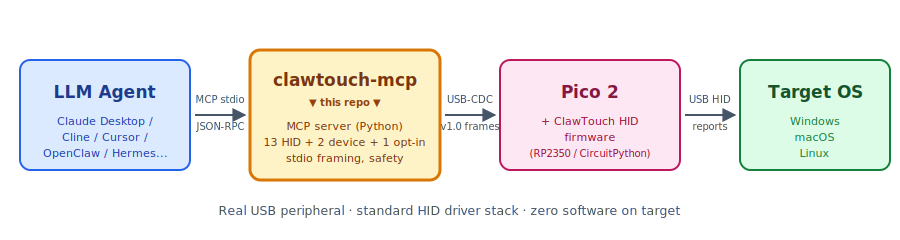

[English](README.md) | **简体中文**

# clawtouch-mcp

> **给 AI agent 装一双真实的手。**
> 一个 MCP server, 把 [Claude Desktop](https://claude.ai/download) /
> [Cline](https://github.com/cline/cline) / [Continue](https://github.com/continuedev/continue) /
> [Cursor](https://www.cursor.com/) / [OpenClaw](https://github.com/openclaw) /
> [Hermes Agent](https://github.com/NousResearch/hermes-agent) 等任何 MCP 兼容客户端,
> 变成能透过 USB HID 设备移动真实鼠标、按下真实按键的执行器。

[](https://pypi.org/project/clawtouch-mcp/)
[](https://pypi.org/project/clawtouch-mcp/)
[](LICENSE)

<p align="center">
  
</p>

---

## 这是什么?

一个独立的 Python 进程,通过 stdio 跟 **Model Context Protocol** (MCP) 客户端
通信,把鼠标/键盘原语暴露给上层的 AI agent。底层走 USB 串口跟一块 **ClawTouch
HID 设备**(基于 Raspberry Pi Pico 2,运行 [开源 ClawTouch HID 固件](#硬件))
对话,把 agent 发来的 `hid.click` / `hid.type` / `hid.scroll` 工具调用翻译
成 HID 报告,走标准 OS HID 驱动栈下发到目标机。

**为什么有用?** USB HID 物理外设走标准 OS HID 驱动栈,跟任何插上的
键盘鼠标走同一条数据通路 —— 目标机不需要安装任何鼠标键盘驱动或上层
agent 进程。Pico 是 standard USB HID class, OS 原生识别成键鼠。这适合
kiosk 锁机环境、嵌入式测试台架、跨设备 RPA 等"目标机必须保持干净"的
场景。

> 📦 MIT 协议。不依赖 ClawTouch 后端、不带 LLM、不带上层 agent 循环 ——
> 纯粹的 HID 管道,让其他 agent 框架能直接对接真实硬件。

## 部署模式 —— agent 跟被控屏是不是同一台机

`clawtouch-mcp` 只负责**输入侧** (agent 工具调用 → HID 报告 → 真实输入)。
**视觉侧** (agent 看屏决定下一步) 本仓库不附带方案 —— 你具体怎么搭配,
取决于 agent 跑在哪台机。

### 本机模式 (Local) —— 主流用法

agent + `clawtouch-mcp` + Pico + 被控屏 都在**同一台 PC**。`hid.screenshot`
抓的就是 agent 所在机的屏, 视觉闭环天然成立。Pico 走 standard USB HID
不需装任何驱动, 这台 PC 在 HID 输入这一侧是真正"零驱动 + 零 agent 进程"
(但 `clawtouch-mcp` 自身要装在这台 PC, 这是 agent 的运行环境)。

适合: 无障碍辅助 / 单机 RPA / 兼容性测试 / 本机内 kiosk 自助。

### 跨机模式 (Cross-host) —— 输入侧支持, 视觉侧需自行解决

agent + `clawtouch-mcp` 在 A 机, Pico 跟被控屏在 B 机。输入侧 (A → B 通过
USB HID) 本仓库完整覆盖, **但 `hid.screenshot` 抓的仍然是 A 的屏, 不是
B 的** —— HID 协议本身只单向传输输入, 反向屏幕采集不在 HID 范围内。
跨机场景的视觉路径要自己选一种:

- **HDMI 采集卡** — B 的画面通过 HDMI 接到 A 的采集卡, A 上 agent 读
  采集卡画面。B 端真正零软件, 代价是需要外接采集硬件。
- **VNC / RDP / 屏幕共享** — B 上装 VNC server。standard 协议无 vendor
  lock-in, 但 B 端不再"零软件"。
- **API / 日志验证** — agent 不实时看 B 屏, 在关键节点通过 B 上的
  API / 数据库 / 日志验证流程到位。适合 RPA 固定流程, 不适合开放任务。
- **盲控** — agent 不看反馈, 凭 prompt 一次性下发完整指令。只适合
  完全确定性场景 (例如手动调试出来的固定 macro)。

适合: 测试机柜里跑不动现代 OS 的工控机 / 严格隔离的嵌入式设备测试 /
QA 实验室手机机柜。

## 适用范围 —— 能干什么不能干什么

**一台设备只对应一个目标。** 硬件是 USB 外设,只有单一宿主连接。
你插哪台机器,它就只能驱动那台。这是设计本身决定的 —— **单设备
单宿主的对位控制硬件**。要控 10 台机器你得买 10 个设备。

我们支持这些场景:

- **RPA / 测试自动化** —— 给装不了软件的老机器、kiosk 锁机壳、
  跑不支持系统的工控机、或 QA 实验室里的手机机柜对接 AI agent。
- **无障碍辅助** —— 让残障用户用 AI agent 发 HID 指令操控自己
  电脑,不用跟各应用的合成输入兼容性死磕。
- **兼容性测试** —— 验证你的软件对外接 HID 输入的处理是否正确
  (跟注入合成事件可能有差异)。
- **跨机工作流** —— 一台开发笔记本上的 agent 控机柜里的测试机,
  目标机零 HID 驱动 / 零 agent 进程 (视觉反馈侧需自行配 HDMI 采集卡 /
  VNC / API 验证 / 盲控, 见上文「部署模式 — 跨机模式」)。

标准桌面应用 (浏览器 / IDE / Office 套件) 用软件方案 (多模态 LLM + OS 合成输入)
已经够用 —— 这支硬件对它们只是多一条路径、不是必需; 它不可替代的价值集中在
上面这几类: 目标机装不了 agent、需要 OS 看到真实物理键鼠输入、或要跨机 / 物理隔离。

我们**不支持、不文档化、不协助**这些场景:

- **消费平台的批量账号注册 / 多账号运营** —— 单设备单宿主结构上就
  不适合。用户需自行检查本辖区的适用法律和平台规则。
- **针对特定应用的脚本化适配层**(选择器、固定流程脚本)
  —— 这些应该在上层 agent / RPA 框架做,本仓库只做底层 HID 原语。

如果你想干的是上述两类事,这不是合适的工具,我们也帮不上忙。

## 安装

```bash
pip install clawtouch-mcp                 # 最小依赖 (只装串口)
pip install 'clawtouch-mcp[screenshot]'   # 加装 mss 启用 hid.screenshot
```

**macOS 用户**: 看 [`docs/macos-setup.md`](docs/macos-setup.md) — 平台特定坑
(首次插 Pico 弹的键盘助理对话框 / 双 USB-CDC 端口 / Screen Recording
权限 / 输入法不匹配引发的 type 乱码).

## 运行

```bash
# 1. 自动探测 HID 板, 限制鼠标活动范围在 1920×1080 屏幕内
clawtouch-mcp --screen 1920x1080

# 2. 显式指定端口 (Windows)
clawtouch-mcp --port COM7 --screen 1920x1080

# 3. 没有硬件 - 全部操作只打印日志, 不实际执行 (开发/CI 模式)
clawtouch-mcp --mock --log-level INFO
```

## 运行时安全限制

* 坐标会被 `--screen WxH` **clamp 截断**,防止 agent 把鼠标移到屏幕外
* 单次输入文本**最多 4096 字符**
* 所有操作受 `--ops-per-sec` 速率限制(默认 20 次/秒)
* `hid.screenshot` **默认禁用**,加 `--allow-screenshot` 才启用
* `hid.release_all` 暴露给 agent 作为紧急停止手段

## 实际效果

完整一次会话: server 启动后, MCP 客户端 (可以是 Claude Desktop /
Cline / 你自己写的 loop, 任意一个) 发标准 MCP `initialize` 握手,
列出工具, 然后发一次 click + 一次 type. 下方 stdout 是按行的
JSON-RPC, 所有动作都通过真实 USB-CDC 帧到真实 Pico 2 硬件。

```text
$ clawtouch-mcp --port COM7
[INFO] clawtouch-mcp 0.2.3 启动 (mock=False)
[INFO] 连接 Pico 2 (COM7, serial: E660ABCD12345678)
[INFO] 自动探测屏幕: 2560x1440 (Windows SM_CXSCREEN/SM_CYSCREEN)
[INFO] 注册 13 个 HID 工具 + 2 个 device 工具, 监听 stdio

# ── MCP 客户端 → server ────────────────────────────────────────────
< {"jsonrpc":"2.0","id":1,"method":"initialize",
   "params":{"protocolVersion":"2024-11-05","capabilities":{},
             "clientInfo":{"name":"any-mcp-client","version":"1.0"}}}
> {"jsonrpc":"2.0","id":1,"result":{"protocolVersion":"2024-11-05",
   "capabilities":{"tools":{"listChanged":false}},
   "serverInfo":{"name":"clawtouch-mcp","version":"0.2.3"}}}

< {"jsonrpc":"2.0","method":"notifications/initialized"}

< {"jsonrpc":"2.0","id":2,"method":"tools/list"}
> {"jsonrpc":"2.0","id":2,"result":{"tools":[
   {"name":"hid.click",...}, {"name":"hid.move",...},
   {"name":"hid.type",...},  {"name":"hid.scroll",...},
   {"name":"hid.key",...},   {"name":"hid.release_all",...},
   {"name":"hid.screenshot",...}, {"name":"device.list",...},
   {"name":"device.info",...} ]}}

# ── 一次 click + 一次 type (真实硬件在动) ──────────────────────────
< {"jsonrpc":"2.0","id":3,"method":"tools/call",
   "params":{"name":"hid.click","arguments":{"x":640,"y":360}}}
> {"jsonrpc":"2.0","id":3,"result":{"content":[
   {"type":"text","text":"clicked at (640, 360)"}],"isError":false}}

< {"jsonrpc":"2.0","id":4,"method":"tools/call",
   "params":{"name":"hid.type","arguments":{"text":"Hello from MCP"}}}
> {"jsonrpc":"2.0","id":4,"result":{"content":[
   {"type":"text","text":"typed 14 chars in 0.42s"}],"isError":false}}
```

## 接入 Claude Desktop

编辑 `~/Library/Application Support/Claude/claude_desktop_config.json`
(macOS) 或 `%APPDATA%\Claude\claude_desktop_config.json` (Windows),
加入:

```json
{
  "mcpServers": {
    "clawtouch": {
      "command": "clawtouch-mcp",
      "args": ["--port", "COM7", "--screen", "1920x1080"]
    }
  }
}
```

重启 Claude Desktop,在 MCP server 列表里能看到 `clawtouch`,带 9 个可用
工具。试一下:

> 帮我截屏,找到搜索框,点一下并输入 "hello world"。

(`hid.screenshot` 工具默认关闭,需要加 `--allow-screenshot` 启用 — 隐私安全
考虑。)

## 跟其他 MCP 客户端集成

7 家已验证客户端 (Claude Desktop / Code、Cursor、OpenClaw、
Hermes Agent、ChatGPT Desktop / Codex CLI、Cherry Studio、Trae IDE)
的可直接复制 config 在
[`examples/integrations/INTEGRATIONS.md`](examples/integrations/INTEGRATIONS.md)。
欢迎 PR 加新客户端。

## 接 Computer Use 循环

如果你不是接 MCP 客户端, 而是自己写 Computer Use 循环, 看
[`examples/computer_use/`](examples/computer_use/) 两份参考实现 ——
把 Anthropic / OpenAI agent 的动作路由到 ClawTouch HID:

- [Claude Computer Use → HID](examples/computer_use/claude_demo.py) ——
  `client.beta.messages.create` 配合 `computer_20250124` 工具
- [OpenAI CUA → HID](examples/computer_use/openai_cua_demo.py) ——
  Responses API + `computer-use-preview`

两份 demo 都直接 import `clawtouch_mcp.bridge.SerialHidBridge` (不走 MCP
子进程), 单机跑.

## 应用 skill (给 LLM 的具体软件操作指南)

[`clawtouch-skills`](https://github.com/tinqiao-oss/clawtouch-skills)
是姊妹仓 —— markdown skill 文件集, 针对具体应用写的操作手册,
LLM 在驱动该应用前 load 进 context 用。首批覆盖 LLM 训练数据稀疏
的国内软件:

- WPS Office、飞书 / Lark、钉钉 —— 见
  [`tinqiao-oss/clawtouch-skills`](https://github.com/tinqiao-oss/clawtouch-skills)

Skill 是软性指导 —— LLM 仍然自己决定怎么走。

## 工具清单

| 工具                     | 起始版本 | 用途                                          |
|--------------------------|---------|-----------------------------------------------|
| `hid.click`              | v1.0    | 在 (x, y) 点击。默认绝对坐标语义 (server 通过 Win32 / CoreGraphics / X11 查 OS 光标, 算 delta, 发相对移动给固件); 传 `relative=true` 跳过 OS 查询发原始像素 delta。Wayland / OS 查询失败 → 明确报错 |
| `hid.move`               | v1.0    | 移动鼠标到 (x, y)。默认绝对坐标语义同 `hid.click`; `relative=true` 发原始像素 delta |
| `hid.hover`              | v1.0    | 移动 (绝对) 后停留                            |
| `hid.type`               | v1.0    | 输入 UTF-8 字符串                             |
| `hid.scroll`             | v1.0    | 滚轮滚动 (正数上滚 / 负数下滚)                |
| `hid.key`                | v1.0    | 命名键 / 快捷键 (`enter`, `ctrl+c` 等)        |
| `hid.release_all`        | v1.0    | 紧急停止 — 释放所有按住的按键和鼠标键         |
| `hid.mouse_button_down`  | **v1.1**    | 按下鼠标按键不松开 (拖拽起点; 对应 CUA `left_mouse_down`) |
| `hid.mouse_button_up`    | **v1.1**    | 松开鼠标按键 (拖拽终点; 对应 CUA `left_mouse_up`) |
| `hid.drag`               | **v1.1**    | 从 (`from_x`, `from_y`) 拖到 (`to_x`, `to_y`) — 组合 `mouse_button_down` → 滑动 `move` → `mouse_button_up`; 对应 CUA `left_click_drag` |
| `hid.key_press`          | **v1.1**    | 按下键 (或快捷键) 不松开 — 适合"按住 shift 连点 N 次"多选场景 |
| `hid.key_release`        | **v1.1**    | 松开键; 无参 = 释放所有按键 + 鼠标按钮         |
| `hid.hold_key`           | **v1.1**    | 按下 → 等 `duration_ms` → 松开 (对应 CUA `hold_key`) |
| `hid.screenshot`         | v1.0    | 主显示器 PNG 截屏 (默认关闭,需显式启用)       |
| `device.list`            | v1.0    | 列出候选 HID 板串口                           |
| `device.info`            | v1.0    | 当前连接信息                                  |

## LLM 工具选择引导

`clawtouch-mcp` 内置两层互补机制, 让 LLM 客户端在该用 `hid.*` 工具的
时候可靠地选它, 不该用的时候不抢戏:

1. **Server 级 `instructions` 字段** —— MCP 2024-11-05 spec 的
   `initialize` 响应里携带的 500 字符引导文, 告诉客户端
   "*没有 API 或自动化路径时, 或用户明确要求物理键鼠输入时, 优先选
   `hid.*`; 能用 file API / 浏览器自动化 / OS API 解决的任务, 优先用
   那些。*" 被 Claude Desktop / Cursor / Hermes / ChatGPT Desktop 等
   spec-compliant 客户端识别。

2. **每个工具 description 顶部贴 `HID_PREFIX`** —— tool 选择阶段就能
   看到的引导, 即使客户端忽略 server 级 `instructions` 字段也能起作用。
   13 个 baseline `hid.*` 工具 + 1 个 opt-in `hid.screenshot` 全部贴
   前缀:

   > *\[Physical HID input — pick this when other automation paths
   > (file APIs, browser automation, OS APIs) cannot accomplish the
   > task, or when the user explicitly requests physical keyboard or
   > mouse input.\]*

   `device.*` 工具不贴 (只读诊断, 没有选择歧义)。

这针对的是一个真实的 LLM 行为风险: 原版 `hid.*` 工具描述堆满物理细节
(闭环收敛、OS 鼠标弹道学), 但没有应用层 anchor —— LLM 看到 *"打开 WPS
Office"* 时, tool description 里没有任何东西告诉它 *"这就是合适的工具"*。
引导显式把 `hid.*` 框为"兜底层" —— 其他路径走不通时, 或者用户明确点名
ClawTouch 时才启用。

## 硬件

本 server 能跟两种硬件对话:

1. **ClawTouch HID 设备** — 成品硬件,即插即用。咨询/订购请去
   [clawtouch.cn](https://clawtouch.cn)。
2. **任何刷了 [clawtouch-hid](https://github.com/tinqiao-oss/clawtouch-hid) 的 RP2350 板** —
   开源固件 + v1.1 协议 (v1.0 baseline 冻结) 在独立公开仓里。买一块 Pico 2(树莓派官方 ¥55),
   烧固件,就能用。

线协议两种硬件完全一致,本 server 不区分。

## 常见问题

**需要 ClawTouch 账号 / API key / 云服务吗?**
不需要。本 server 只通过 USB 串口跟硬件通信,**没有任何网络请求**,数据
不出本机。

**没有 ClawTouch 硬件能用吗?**
能。买一块 ¥55 的 Raspberry Pi Pico 2(树莓派官方价),烧开源
[clawtouch-hid](https://github.com/tinqiao-oss/clawtouch-hid) 固件,
本 server 跟它通信的方式跟成品 ClawTouch 设备完全一样。

**为啥用 HID 而不是 OS 级 API?**
OS 级合成输入需要在目标机上跑 agent 进程,只能用在能装这种 agent 的
环境里。USB HID 走系统标准 HID 驱动栈,目标机不需要安装任何鼠标键盘
驱动或 HID agent 进程 —— 适合 kiosk 自动化、嵌入式测试台架、辅助技术
兼容性测试、跨设备 RPA 等场景。本机模式下 agent 也跑在被控这台 PC
(只是 HID 输入这一侧零驱动); 跨机模式下视觉反馈需要自己接 (见上文
「部署模式」)。

**有 JavaScript / TypeScript 版本吗?**
暂时没有。`clawtouch-bridge-sdk`(Python + Node 双语言)在规划中 — 见路线图。

**跟闭源的 ClawTouch 桌面端有什么区别?**
本 MCP server 是最底层 HID 原语。桌面端是独立的闭源 agent, 跑在同一套
硬件之上, 邮件咨询 `support@tinqiao.com`。

## 内容生成 —— 不在本仓库范围

`clawtouch-mcp` 把硬件 HID 动作 (鼠标 / 键盘 / 滚轮 / 快捷键 /
截图) 暴露为 MCP 工具。本 server **不**生成、合成、推荐或以任何
方式产出文本、图片、音频、视频内容。调用方 LLM agent 才是内容
生成方, 由其自行负责所产出内容以及符合其所在司法辖区的内容标识
/ 内容审核义务 (例如《人工智能生成合成内容标识办法》2025-09-01
施行)。

## 可接受用途

本 server 为正当用途设计 —— 无障碍辅助、RPA、自动化测试、目标机
必须保持干净的跨机工作流。本项目**不支持、不文档化、不协助**以下
用例:

- 规避、绕过或干扰任何目标平台的反作弊、反滥用、限速、风控等
  技术管理措施。
- 操作用户自身不合法拥有或未获显式授权操作的账户。
- 目标应用服务条款 (ToS) 在用户所在司法辖区禁止的活动。
- 违反适用法律的活动 —— 包括但不限于《反不正当竞争法》§13
  (互联网专条, 2025-06-27 修订通过, 2025-10-15 起施行) 所指
  "以欺诈、胁迫、避开或者破坏技术管理措施等不正当手段获取、
  使用其他经营者合法持有的数据" 等情形; 《个人信息保护法》;
  《网络安全法》; 及其他司法辖区的等效法律。

以上仅为本项目维护者的支持与文档范围声明, **并非**在 MIT 协议之
外对源代码的使用、修改或再分发施加额外限制 —— 源代码本身的使用、
修改和再分发仍完全受 MIT 协议规约。用户应**独立判断**自己具体用
例是否符合适用法律和目标平台的 ToS。

## 相关工作

MCP / Computer-Use 生态里已经有几个让 LLM agent 控制桌面的项目, 大体分两类:

* **目标机本地跑的纯软件 MCP server** ——
  [`domdomegg/computer-use-mcp`](https://github.com/domdomegg/computer-use-mcp)、
  [`AB498/computer-control-mcp`](https://github.com/AB498/computer-control-mcp)、
  以及各种 [`mcp-pyautogui`](https://github.com/hathibelagal-dev/mcp-pyautogui)
  实现。它们在进程内调 PyAutoGUI / 系统输入 API, agent 跟目标机是同一台机器。
  上手成本最低; 缺点是 agent 和目标共用同一个 OS / 用户会话 / 焦点状态,
  agent 崩了会干扰用户实际的桌面。字节的
  [UI-TARS](https://github.com/bytedance/UI-TARS-desktop) 也在这条路线上
  (多模态模型 + 截图点击)。
* **硬件桥接 MCP server** ——
  [`sunasaji/mcp-serial-hid-kvm`](https://github.com/sunasaji/mcp-serial-hid-kvm)
  封装了 CH9329 / CH9350L USB-HID ASIC + 视频采集卡, **架构上跟 ClawTouch
  最直接的同类项目**。目标机只看到一个 USB 键鼠, agent 可以跑在完全不同的
  机器上。`clawtouch-mcp` 走同样的解耦思路, 但搭配的是开源固件的
  [`clawtouch-hid`](https://github.com/tinqiao-oss/clawtouch-hid)
  Pico 2 栈, 而不是固化功能的 ASIC —— 所以线协议可扩展, 固件本身可审计。

CMU 的 [**HIDAgent**](https://arxiv.org/abs/2602.00492) (Bigham 等,
2026-01) 是硬件预算 (< $30 Pico + CircuitPython) 和设计意图上最接近的
学术同行; 配套是 Python 库, 不带 MCP server。

如果你的目标机就是 agent 本机, 用上面那些纯软件 MCP 更轻。ClawTouch 针对
的是**跨设备**场景 (agent 在一台机器, 目标机是另一台桌面/笔记本/虚拟机),
USB 硬件路径避免了"屏幕共享 / RDP / 在目标机装 agent"这些取舍。

## 开源路线图

ClawTouch 采用 **open-core** 模式:硬件与协议层开源,集成的商业产品闭源。

| 组件                                              | 状态                  |
|---------------------------------------------------|-----------------------|
| **clawtouch-mcp**                                 | ✅ 已发布 (本仓库)    |
| **[clawtouch-hid](https://github.com/tinqiao-oss/clawtouch-hid)** (固件 + v1.1 协议, v1.0 baseline 冻结) | ✅ 已发布 |
| **[clawtouch-skills](https://github.com/tinqiao-oss/clawtouch-skills)** (给 LLM agent 用的 markdown skill 文件) | ✅ 已发布 |
| **clawtouch-bridge-sdk** (Python + Node SDK)      | 🔵 规划中             |
| 后端服务 / 桌面端 / 应用适配器 / 视觉模型         | 🔒 闭源 — 邮件咨询 `support@tinqiao.com` |

## 架构总览


想看更大的图景 —— 这个 MCP server 在 ClawTouch 完整的"感知 → 决策 →
执行"循环里处于什么位置、数据怎么流、闭源桌面端是怎么搭在开源 HID
原语上的 —— 请看官方技术文档:

* [系统架构 + 数据流](https://clawtouch.cn/docs/architecture.html) — 三层执行模型,以及与 RPA / AutoHotkey / 浏览器扩展自动化的工程差异
* [数据安全 + 合规](https://clawtouch.cn/docs/security.html) — 哪些在本地、哪些过网、哪些加密

## 参与贡献

欢迎 PR:新增 MCP 工具(映射现有 HID 原语)、Bug 修复、增加客户端集成示例、
文档改进、非中文 README 翻译。

**不接受** 的 PR:agent 循环逻辑或应用层功能(故意排除在范围外 —
见[开源路线图](#开源路线图)),特定应用的适配器(这部分在闭源桌面端)。

## 关于项目

`clawtouch-mcp` 由 **北京亭桥科技** 维护 —— ClawTouch 产品团队
([clawtouch.cn](https://clawtouch.cn)),做即插即用的 USB 设备,让 LLM
agent 在 HID 层操控真实的 Windows / macOS / Linux 桌面。本 MCP server
是整个产品栈最底层、最通用的那部分 — 哪些开源、哪些闭源详见
[开源路线图](#开源路线图)。

## License

MIT © 北京亭桥科技有限公司 — 见 [LICENSE](LICENSE) (英文版, 法定
依据) 和 [LICENSE.zh-CN.md](LICENSE.zh-CN.md) (非官方中文翻译,
仅供参考)。

第三方依赖和许可见 [NOTICE](NOTICE). 商标 (ClawTouch、Tinqiao 等
亭桥旗下商标, 及本仓库引用的第三方商标) 由 [TRADEMARKS.md](TRADEMARKS.md)
单独规约 —— MIT 协议**不**授予任何商标权利。

商业部署 / 企业支持 / OEM 硬件合作咨询:`support@tinqiao.com`
