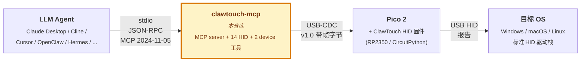

[English](README.md) | **简体中文**

# clawtouch-mcp

> **给 AI agent 装一双真实的手。**
> 一个 MCP server, 把 [Claude Desktop](https://claude.ai/download) /
> [Cline](https://github.com/cline/cline) / [Continue](https://github.com/continuedev/continue) /
> [Cursor](https://www.cursor.com/) / [OpenClaw](https://github.com/openclaw/openclaw) /
> [Hermes Agent](https://github.com/NousResearch/hermes-agent) 等任何 MCP 兼容客户端,
> 变成能透过 USB HID 设备移动真实鼠标、按下真实按键的执行器。

[](https://pypi.org/project/clawtouch-mcp/)
[](https://pypi.org/project/clawtouch-mcp/)
[](LICENSE)
[](https://clawtouch.cn)
[](https://glama.ai/mcp/servers/tinqiao-oss/clawtouch-mcp)

<p align="center">
  
</p>

---

## 这是什么?

一个独立的 Python 进程,通过 stdio 跟 **Model Context Protocol** (MCP) 客户端
通信,把鼠标 / 键盘原语 —— `hid.click`、`hid.type`、`hid.scroll`、组合键、
`hid.screenshot` —— 暴露给你已有的 AI agent。底层走 USB 串口跟一块 **ClawTouch
HID 设备**(基于 Raspberry Pi Pico 2、运行 [开源 ClawTouch HID 固件](#硬件),或
任意一台开箱即用的 ClawTouch 盒子)对话,把每一次工具调用翻译成真实的 USB HID
报告。目标机看到的是一套**真实的物理键盘鼠标** —— 输入走的是和任何插上的外设
完全相同的驱动通路,而不是软件注入的合成事件。

> 📦 MIT 协议。不依赖 ClawTouch 后端、不带 LLM、不带上层 agent 循环 ——
> 纯粹的 HID 管道,让其他 agent 框架能直接对接真实硬件。

> ⚠️ 这会给 agent 一双对某台机器**真实的键鼠操作能力** ——
> 等同于一个人坐在键盘前。请先读 [安全](#安全)。

## 为什么用硬件 HID?

软件自动化(PyAutoGUI、OS 级输入 API、多模态"看屏点击"模型)是往会话里**注入
合成**输入事件 —— 这要求目标机上有一个 agent 进程在跑,跟在同一用户会话、还得
拿到焦点。USB HID 外设反过来:它发出的是**真实**的 HID 报告,走标准 OS HID 驱动
栈,跟一块插上的键盘鼠标完全一样。OS 原生把 Pico 识别成 standard USB HID class
设备,目标机在**输入这一侧不需要任何鼠标键盘驱动、也不需要 HID agent 进程**。这
个差别就是本项目存在的全部理由 —— 下面每一节都建立在它之上。

**本机模式是主流用法**(agent + `clawtouch-mcp` + Pico + 被控屏全在同一台 PC;
`clawtouch-mcp` 进程装在这里是因为它是 agent 的运行环境,但输入侧零驱动)。跨机
控制 —— agent 在一台机、通过 USB HID 驱动另一台机上的目标 —— 是同一套硬件解锁的
*额外*能力;见 [部署模式](#部署模式)。

**适合:**

- **kiosk / 锁机环境** —— 驱动一台你装不了(或不想装)软件的机器,输入侧不跑任何
  额外东西。
- **无障碍辅助** —— 让用户用 agent 发 HID 指令操控自己的电脑,不用跟各应用的合成
  输入兼容性死磕。
- **兼容性测试** —— 验证你的软件对*外接* HID 输入的处理是否正确(跟注入的合成事件
  可能有差异)。
- **跨机 RPA / 测试台架** —— 开发笔记本上的 agent 去驱动工控机、离线测试目标、或
  QA 实验室的手机,目标机零 agent(视觉反馈需另配一条路径 —— 见部署模式)。

**不适合:**

- **批量账号注册 / 多账号运营** —— 单设备单宿主结构上就不适合;一台设备只对应一个
  目标。要控 10 台机器你得买 10 个设备。
- **针对特定应用的脚本化适配层**(选择器、固定流程脚本) —— 这些应该在上层
  agent / RPA 框架做,本仓库只做底层 HID 原语。

标准桌面应用(浏览器 / IDE / Office 套件)用软件方案已经够用 —— 硬件对它们只是多
一个选项、不是必需。它不可替代的价值集中在上面这几类:目标机装不了 agent、需要让
OS 看到真实物理 HID 设备、或要跨机驱动。"不适合"那两类的合规边界另见
[可接受用途](#可接受用途)。

## 快速上手

> ⚠️ 动手前先读 [安全](#安全):接入的 agent 能像真人一样操作这台机器。

### 安装

```bash
pip install clawtouch-mcp                 # 最小依赖 (只装串口)
pip install 'clawtouch-mcp[screenshot]'   # 加装 mss 启用 hid.screenshot
```

**平台特定配置指南** (首次安装建议先看):

* **Windows** — [`docs/windows-setup.md`](docs/windows-setup.md): 双 COM 口
  枚举、VS Code Claude 扩展 `.mcp.json` 配置、需整窗重启、显示缩放注意事项。
* **macOS** — [`docs/macos-setup.md`](docs/macos-setup.md): 首次插 Pico 弹的
  键盘助理对话框、双 USB-CDC 端口、Screen Recording 权限、拼音输入法标点坑。

### 运行

```bash
# 1. 自动探测 HID 板, 并自动探测屏幕尺寸 (v0.2.3+)
clawtouch-mcp

# 2. 显式指定端口 (Windows), 屏幕仍自动探测
clawtouch-mcp --port COM7

# 3. 手动锁定屏幕尺寸 (例如多显示器时 clamp 到单块屏)
clawtouch-mcp --screen 1920x1080

# 4. 没有硬件 — 全部操作只打印日志, 不实际执行 (开发/CI 模式)
clawtouch-mcp --mock --log-level INFO
```

> v0.2.3+ 在启动时自动探测主显示器的物理像素尺寸, 让坐标 clamp 到真实
> 屏幕、而不是硬编码的 `1920x1080`。从你的 MCP 客户端调 `device.info`
> 可以看到探测到了什么 (`screen.source` 为 `"detected"` /
> `"explicit"` / `"unset"`)。

### 接入 Claude Desktop

编辑 `~/Library/Application Support/Claude/claude_desktop_config.json`
(macOS) 或 `%APPDATA%\Claude\claude_desktop_config.json` (Windows),
加入:

```json
{
  "mcpServers": {
    "clawtouch": {
      "command": "clawtouch-mcp",
      "args": ["--port", "COM7", "--screen", "1920x1080"]
    }
  }
}
```

重启 Claude Desktop,在 MCP server 列表里能看到 `clawtouch`,带 15 个可用
工具 (14 个 HID + 2 个 device; 传 `--allow-screenshot` 再 +1)。试一下:

> 帮我截屏,找到搜索框,点一下并输入 "hello world"。

(`hid.screenshot` 工具默认关闭,需要加 `--allow-screenshot` 启用 — 隐私安全
考虑。)

### 其他 MCP 客户端

7 家已验证客户端 (Claude Desktop / Code、Cursor、OpenClaw、
Hermes Agent、ChatGPT Desktop / Codex CLI、Cherry Studio、Trae IDE)
的可直接复制 config 在
[`examples/integrations/INTEGRATIONS.md`](examples/integrations/INTEGRATIONS.md)。
欢迎 PR 加新客户端。

## 部署模式

*agent 跟被控屏是不是同一台机?* `clawtouch-mcp` 只负责**输入侧** (agent 工具调用 → HID 报告 → 真实输入)。**视觉侧** (agent 看屏决定下一步) 本仓库不附带方案 —— 你具体怎么搭配,取决于 agent 跑在哪台机。

**本机模式 (Local) —— 主流用法。** agent + `clawtouch-mcp` + Pico + 被控屏 都在**同一台 PC**。`hid.screenshot` 抓的就是这块屏,视觉闭环天然成立;Pico 走 standard USB HID,不需装任何驱动。适合:无障碍辅助 / 单机 RPA / 兼容性测试 / 本机内 kiosk 自助。

**跨机模式 (Cross-host) —— 输入侧支持,视觉侧需自行解决。** agent + `clawtouch-mcp` 在 A 机,Pico 跟被控屏在 B 机。输入侧 (A → B 通过 USB HID) 本仓库完整覆盖,**但 `hid.screenshot` 抓的仍然是 A 的屏,不是 B 的** —— HID 只单向传输输入,反向屏幕采集不在 HID 范围内。视觉路径要自己选一种:**HDMI 采集卡** (B 端真正零软件,代价是外接采集硬件) · **VNC / RDP** (standard 协议无 vendor lock-in,但 B 端不再"零软件") · **API / 日志验证** (关键节点验证,非实时;仅适合固定流程 RPA) · **盲控** (一次性下发完整指令、不看反馈;仅适合完全确定性 macro)。适合:跑不动现代 OS 的工控机 / 严格隔离的嵌入式测试目标 / QA 实验室手机机柜。

## 安全

### 运行时安全限制

* 坐标会被 `--screen WxH` **clamp 截断**,防止 agent 把鼠标移到屏幕外
* 单次输入文本**最多 4096 字符**
* `hid.type` 仅适合 **ASCII / US 键盘布局文本**。控制字符(换行 / Tab 等)
  默认会被**剥除**(免得 agent 的多行草稿被误提交)—— 换行请用
  `hid.key("enter")`、Tab 请用 `hid.key("tab")`。非 ASCII 文本(中文、emoji)
  经 US 布局逐字符键入, 一般**打不出来**; 这类文本请在 agent 层走宿主
  输入法 / 剪贴板方案。
* 所有操作受 `--ops-per-sec` 速率限制(默认 20 次/秒)
* `hid.screenshot` **默认禁用**,加 `--allow-screenshot` 才启用
* `hid.release_all` 暴露给 agent 作为紧急停止手段

### 接入本工具的 agent 能做什么

> 接入自主 agent 前请先读本节。上面的运行时限制是防误点/防洪泛的护栏,
> **不是**针对失控 agent 的安全边界。

`clawtouch-mcp` 把你的 agent 的工具调用变成**真实的 USB HID 输入** —— 正是这一
特性让那些正当用途成立(kiosk、无障碍辅助、兼容性测试、跨机 RPA),它同时也带
来一个对称的风险:

**接入这里的自主 agent,实际上对宿主机的触及范围跟坐在键盘前的真人相当。**它
可以打开任意程序、在终端里执行命令、安装或卸载软件、读取/移动/删除文件。由于输
入以普通 HID 形式送达,确认弹窗本身并不能可靠地拦住它 —— 应把任何同意类弹窗都
视为 agent 可能会去操作的对象。`clawtouch-mcp` **不会**检查意图或内容,它只是把
每一次调用忠实转发给硬件。

这一切可能**并非出于你的本意**,因为决定做什么的是 *agent*。常见触发因素:

- **提示词注入 (prompt injection)。**agent 从屏幕、网页或图片里读到的不可信文本,
  可能嵌有覆盖你指令的对抗性指示。
- **模型出错。**模型误解了任务,在错误的窗口、文件或按钮上动作。
- **过宽的自主权。**任务越开放、检查点越少,爆炸半径就越大。

这是一种**非预期失效模式**,并非受支持的用法 —— 故意用 HID 输入去破坏某个系统
的安全措施,属于下文**可接受用途**的范围之外。它也与 [`SECURITY.md`](SECURITY.md)
里讲的软件漏洞是不同的关注点:那些都不覆盖 agent **违背你本意**行动这种情形。
MIT 协议的「AS IS / 不提供任何担保」是免责条款,不是 informed-risk 披露;安全地
运行一个自主 agent 的责任在你这位部署者身上。本节仅供参考,不修改、限缩或扩张
MIT 协议,不构成任何担保或注意义务,亦不将责任转移给亭桥;MIT 的免责与责任限制
条款继续完整适用。

### 部署者缓解措施

把驱动 HID 输入的 agent,当成你交给了一位能力强但尚不完全可信的操作员一双能动手
的真手。建议:

- **用可随时重置/重装的专用机器(或虚拟机 / 容器)** —— 不要用你的主力电脑。
  Local mode 把 agent 和目标放在同一台 PC:方便,但爆炸半径最大;条件允许时优先
  用单独的机器。
- **以最小权限的 OS 账户运行**,绝不用 administrator / root —— agent 会继承该账户
  能做的一切。
- **把敏感数据和已登录账户挪出目标机** —— 不保存密码、不保留已认证会话、不把凭据
  写进 prompt。
- **在有现实后果或不可逆的动作前保留 human-in-the-loop**(安装/删除软件、发送消息、
  金融交易、同意条款);不要让 agent 在开放式任务上无人值守长跑。
- **隔离网络**(例如域名白名单),减少接触恶意或带注入内容的机会。
- **把从屏幕或网页读到的一切都当作不可信输入**,并将其与敏感数据和动作隔离。
- **随手备好急停。**`hid.release_all` 可从 agent 一侧释放所有按下的键和鼠标按钮;
  物理拔掉 HID 设备的 USB 线是最可靠的急停,能彻底切断 agent 的输入通路。

如果你是代表他人部署本工具(无障碍辅助、托管式 RPA),请将上述风险告知这些最终
用户并取得其同意。

## 工具清单

共注册 17 个工具:**14 个常驻 `hid.*` 输入工具**,外加 **`hid.screenshot`**
(opt-in —— 不传 `--allow-screenshot` 时默认关闭),再加 **2 个只读 `device.*`
诊断工具**。这与启动日志那行 `14 HID tools + 2 device tools registered` 一致
(`--allow-screenshot` 会在此之上再加上 `hid.screenshot`,凑满 17 个)。

| 工具 | 起始版本 | 用途 |
|------|----------|------|
| `hid.click` | v1.0 | 在 (x, y) 点击 |
| `hid.move` | v1.0 | 把鼠标移到 (x, y) |
| `hid.hover` | v1.0 | 移到 (x, y) 后悬停 |
| `hid.type` | v1.0 | 输入一段 UTF-8 字符串 |
| `hid.scroll` | v1.0 | 滚轮上 / 下滚动 |
| `hid.key` | v1.0 | 按下具名键或快捷键(`enter`、`ctrl+c` …) |
| `hid.release_all` | v1.0 | 紧急停止 —— 释放所有按下的键和鼠标按钮 |
| `hid.mouse_button_down` | v1.1 | 按下鼠标按钮但不松开(拖拽起点) |
| `hid.mouse_button_up` | v1.1 | 松开按住的鼠标按钮(拖拽终点) |
| `hid.drag` | v1.1 | 按住按钮从一点拖到另一点 |
| `hid.key_press` | v1.1 | 按下某键 / 快捷键但不松开 |
| `hid.key_release` | v1.1 | 松开按住的键(无参 = 全部释放) |
| `hid.hold_key` | v1.1 | 按下 → 等待 → 松开 |
| `hid.batch` | v0.4.0 | 一次调用按严格顺序跑 ≤10 个 HID 动作(预先排好的序列) |
| `hid.screenshot` | v1.0 | 主显示器截屏 —— 默认 JPEG q80,传 `format='png'` 取无损(默认关闭,需 `--allow-screenshot` 启用) |
| `device.list` | v1.0 | 列出候选 HID 板串口 |
| `device.info` | v1.0 | 当前连接信息 |

**坐标与行为。**click / move / hover **默认走绝对坐标**:server 先查询 OS 当前
光标位置(Win32 / CoreGraphics / X11),算出到目标点的偏移,再向固件发出一个
**相对位移** —— 所以 `{"x": 640, "y": 360}` 会落在那个屏幕像素上。传
`relative=true` 则跳过 OS 查询、直接发原始像素位移。当 OS 光标读不到时
(Wayland,或任何 OS 查询失败)调用返回**显式错误** —— 绝不会静默猜测、点到错
误的位置。`hid.drag` 由 `mouse_button_down` → 滑动 `move` → `mouse_button_up`
组合而成;`v1.1` 的按住类工具(`mouse_button_*`、`key_press` / `key_release`、
`hold_key`)对位映射到 Computer-Use Anthropic(CUA)动作集。`hid.batch`
一次调用按严格顺序跑一串(≤10)这类动作 —— 这是给**预先排好的动作序列**(例如
solver 算出的若干固定坐标)用的传输便利,**不是**编排 / "动作 → 观察 → 决策"
的控制流层;后者仍需分多次调用。连续 click 之间会自动垫一个小默认间隔
(~50ms), 防 OS 把背靠背的点击合并/丢弃;可用每个 op 的 `delay_ms` 覆盖
(设 0 关闭)。

**工具选择。**server 内置选择引导,让 agent 只在该用的时候才去选物理 HID:
`initialize` 响应里的 MCP `instructions` 字段,加上贴在每个 `hid.*` description
顶部的 `HID_PREFIX`(即使客户端忽略 server 级字段,这条提示也仍然有效)。两者表达
同一件事 —— 仅把 `hid.*` 当**兜底**:在没有任何文件 / 浏览器 / OS API 能完成任务
时,或用户明确要求物理键鼠输入时,才选它。只读的 `device.*` 工具不带前缀。

## 实际效果

针对你的桥接设备启动 server,然后任意 MCP 客户端(Claude Desktop、
Cline,或你自己的循环)都用最朴素的 MCP `tools/call` 经 stdio 通信。
每一次调用都变成一帧真实的 USB-CDC 帧、送到真实硬件 —— 没有任何合成
成分。

```text
$ clawtouch-mcp --port COM7
[INFO] 连接 Pico 2 (COM7, serial: E660ABCD12345678)
[INFO] 自动探测屏幕: 2560x1440 (Windows SM_CXSCREEN/SM_CYSCREEN)
[INFO] 注册 14 个 HID 工具 + 2 个 device 工具, 监听 stdio

# 客户端 → server : 先一次点击, 再输入一段字符串
#                   (光标和按键是真的在动)
→ tools/call  hid.click  {"x": 640, "y": 360}
← result       "clicked at (640, 360)"

→ tools/call  hid.type   {"text": "Hello from MCP"}
← result       "typed 14 chars in 0.42s"
```

## 示例

多数 agent 通过 MCP 客户端(Claude Desktop / Code、Cursor 等)接入 `clawtouch-mcp` —— 已验证客户端的可直接复制配置见 [`examples/integrations/INTEGRATIONS.md`](examples/integrations/INTEGRATIONS.md)。

如果你不接 MCP 客户端、而是自己写 Computer Use 循环,[`examples/computer_use/`](examples/computer_use/) 有两份参考实现,把 agent 的动作路由到 ClawTouch HID:

- [Claude Computer Use → HID](examples/computer_use/claude_demo.py) —— `client.beta.messages.stream` 配合 `computer_20251124` 工具
- [OpenAI CUA → HID](examples/computer_use/openai_cua_demo.py) —— Responses API + `computer-use-preview`

针对具体应用的 LLM 指南,[`clawtouch-skills`](https://github.com/tinqiao-oss/clawtouch-skills) 是姊妹仓 —— markdown 操作手册集,LLM 在驱动某个应用前可 load 进 context。Skill 是软性指导 —— LLM 仍然自己决定怎么走。

## 内容生成 —— 不在本仓库范围

`clawtouch-mcp` 把硬件 HID 动作 (鼠标 / 键盘 / 滚轮 / 快捷键 /
截图) 暴露为 MCP 工具。本 server **不**生成、合成、推荐或以任何
方式产出文本、图片、音频、视频内容。调用方 LLM agent 才是内容
生成方, 由其自行负责所产出内容以及符合其所在司法辖区的内容标识
/ 内容审核义务 (例如《人工智能生成合成内容标识办法》2025-09-01
施行)。

## 可接受用途

本 server 为正当用途设计 —— 无障碍辅助、RPA、自动化测试、目标机
必须保持干净的跨机工作流。本项目**不支持、不文档化、不协助**以下
用例:

- 规避、绕过或干扰任何目标平台的反作弊、反滥用、限速、风控等
  技术管理措施。
- 操作用户自身不合法拥有或未获显式授权操作的账户。
- 目标应用服务条款 (ToS) 在用户所在司法辖区禁止的活动。
- 违反适用法律的活动 —— 包括但不限于《反不正当竞争法》§13
  (互联网专条, 2025-06-27 修订通过, 2025-10-15 起施行) 所指
  "以欺诈、胁迫、避开或者破坏技术管理措施等不正当手段获取、
  使用其他经营者合法持有的数据" 等情形; 《个人信息保护法》;
  《网络安全法》; 及其他司法辖区的等效法律。

以上仅为本项目维护者的支持与文档范围声明, **并非**在 MIT 协议之
外对源代码的使用、修改或再分发施加额外限制 —— 源代码本身的使用、
修改和再分发仍完全受 MIT 协议规约。用户应**独立判断**自己具体用
例是否符合适用法律和目标平台的 ToS。

## 硬件

本 server 能跟两种硬件对话:

1. **ClawTouch HID 设备** — 成品硬件,即插即用。咨询/订购请去
   [clawtouch.cn](https://clawtouch.cn)。
2. **任何刷了 [clawtouch-hid](https://github.com/tinqiao-oss/clawtouch-hid) 的 RP2350 板** —
   开源固件 + v1.1 协议 (v1.0 baseline 冻结) 在独立公开仓里。买一块 Pico 2(树莓派官方 ¥55),
   烧固件,就能用。

线协议两种硬件完全一致,本 server 不区分。

## 常见问题

**需要 ClawTouch 账号 / API key / 云服务吗?**
不需要。本 server 只通过 USB 串口跟硬件通信,**没有任何网络请求**,数据
不出本机。

**没有 ClawTouch 硬件能用吗?**
能。买一块 ¥55 的 Raspberry Pi Pico 2(树莓派官方价),烧开源
[clawtouch-hid](https://github.com/tinqiao-oss/clawtouch-hid) 固件,
本 server 跟它通信的方式跟成品 ClawTouch 设备完全一样。

**跟闭源的 ClawTouch 桌面端有什么区别?**
本 MCP server 是最底层 HID 原语。桌面端是独立的闭源 agent, 跑在同一套
硬件之上, 邮件咨询 `support@tinqiao.com`。

**有 JavaScript / TypeScript 版本吗?**
暂时没有。`clawtouch-bridge-sdk`(Python + Node 双语言)在规划中 —— 见
[开源路线图](#开源路线图参与贡献与-license)。

## 相关工作

MCP / Computer-Use 生态里已经有几个让 LLM agent 控制桌面的项目, 大体分两类。**目标机本地跑的纯软件 MCP server** —— [`domdomegg/computer-use-mcp`](https://github.com/domdomegg/computer-use-mcp)、[`AB498/computer-control-mcp`](https://github.com/AB498/computer-control-mcp)、各种 [`mcp-pyautogui`](https://github.com/hathibelagal-dev/mcp-pyautogui) 实现, 以及字节的 [UI-TARS](https://github.com/bytedance/UI-TARS-desktop) —— 在进程内调 PyAutoGUI / 系统输入 API: 上手成本最低, 但 agent 跟目标共用同一个 OS / 会话 / 焦点状态, 崩了会干扰用户实际的桌面。**硬件桥接 server** 把两者解耦: [`sunasaji/mcp-serial-hid-kvm`](https://github.com/sunasaji/mcp-serial-hid-kvm) (CH9329 / CH9350L USB-HID ASIC + 采集卡) 是架构上最直接的同类项目, CMU 的 [**HIDAgent**](https://arxiv.org/abs/2602.00492) (Bigham 等, 2026-01; < $30 的 RP2040 + HDMI→USB + CH340 串口桥, 以 Python 库形式发布) 是最接近的学术同行。`clawtouch-mcp` 走同样的解耦思路, 但搭配的是开源固件的 [`clawtouch-hid`](https://github.com/tinqiao-oss/clawtouch-hid) 栈 —— 所以线协议可扩展、固件可审计, 而不是固化功能的 ASIC。

ClawTouch 的不可替代之处是那条**真实硬件 HID 通路**: OS 看到的是真实物理键鼠。本机模式 —— 也是常见场景 —— 下, 这条真实 HID 加上输入侧零驱动, 正是无障碍 / 兼容性测试 / 挑剔合成输入的应用用得上的点; 如果你只是在本机做合成输入、且应用不挑输入来源, 上面那些纯软件 server 更省事。跨机模式是在此之上的*额外*能力: 它能控制装不了 agent、或必须物理隔离的目标机, 这是纯软件方案根本做不到的。

## 开源路线图、参与贡献与 License

**open-core 模式。**硬件与协议层原语开源;集成的商业产品闭源。

| 组件 | 状态 |
|---|---|
| **clawtouch-mcp**(本仓库) | ✅ 已发布 |
| **[clawtouch-hid](https://github.com/tinqiao-oss/clawtouch-hid)** — 固件 + 协议模块,wire epoch 1 | ✅ 已发布 |
| **[clawtouch-skills](https://github.com/tinqiao-oss/clawtouch-skills)** — 给 LLM agent 用的 markdown skill 文件 | ✅ 已发布 |
| **clawtouch-bridge-sdk** — Python + Node HID SDK | 🔵 规划中 |
| 后端服务 / 桌面端 / 应用适配器 / 视觉模型 | 🔒 闭源 — `support@tinqiao.com` |

### 参与贡献

欢迎 PR:新增映射现有 HID 原语的 MCP 工具、Bug 修复、客户端集成示例、文档改进、非中文 README 翻译。

不接受的 PR:agent 循环逻辑或应用层功能(故意排除在范围外 — 见[可接受用途](#可接受用途)),以及特定应用的适配器(这部分在闭源桌面端)。

`clawtouch-mcp` 由 **北京亭桥科技** 维护 —— ClawTouch 产品团队([clawtouch.cn](https://clawtouch.cn))。

### License

MIT © 北京亭桥科技有限公司 — 见 [LICENSE](LICENSE) (英文版, 法定
依据) 和 [LICENSE.zh-CN.md](LICENSE.zh-CN.md) (非官方中文翻译,
仅供参考)。

第三方依赖和许可见 [NOTICE](NOTICE). 商标 (ClawTouch、Tinqiao 等
亭桥旗下商标, 及本仓库引用的第三方商标) 由 [TRADEMARKS.md](TRADEMARKS.md)
单独规约 —— MIT 协议**不**授予任何商标权利。

商业部署 / 企业支持 / OEM 硬件合作咨询:`support@tinqiao.com`

## 架构总览



本仓库就是中间这一跳的 MCP server:把 MCP 工具调用翻译成 USB-CDC 上的带帧字节,固件再转成标准 USB HID 报告。想了解它在完整的"感知 → 决策 → 执行"循环里的位置、以及闭源桌面端如何搭在这些开源 HID 原语之上,请看官方技术文档:[系统架构 + 数据流](https://clawtouch.cn/docs/architecture.html) 与 [数据安全 + 合规](https://clawtouch.cn/docs/security.html)。